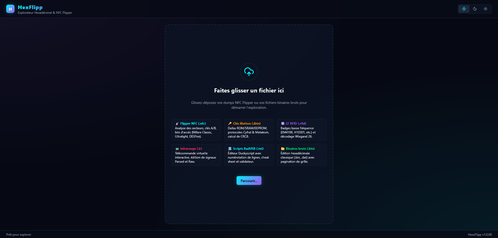
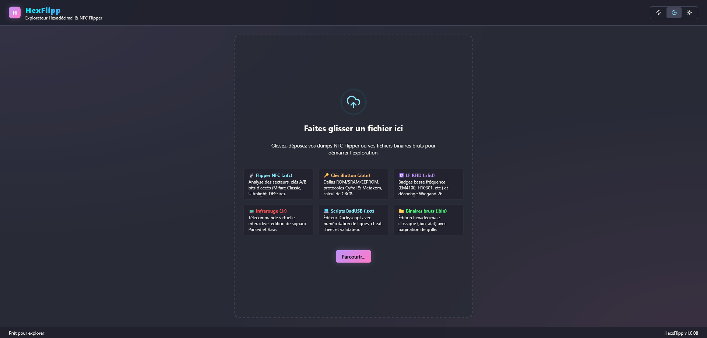
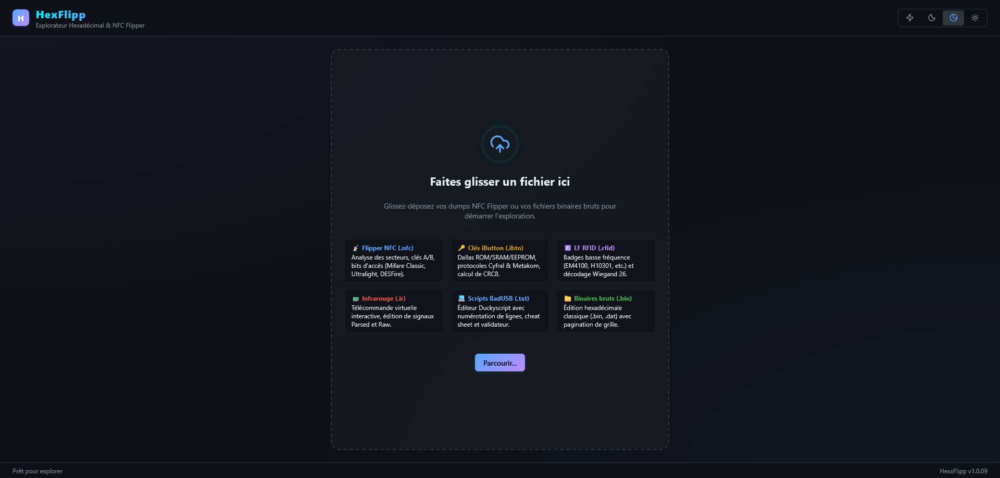
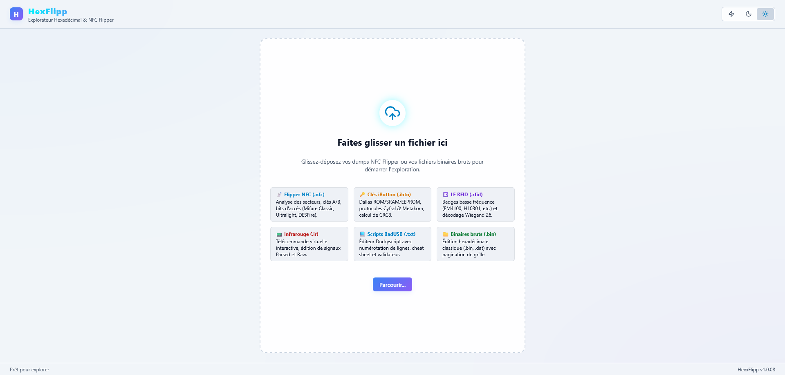

# 🐬 HexxFlipp

> 🐬 The offline companion for your Flipper Zero — 🔬 hex editing, Mifare decoding, diff comparison. Multi-format (NFC, iButton, RFID, IR, BadUSB, Sub-GHz), single-file HTML.

A standalone web app that turns your Flipper dumps into readable, editable and comparable data — directly in your browser, no server, no network.

---

## 📸 Screenshots

<table>
  <tr>
    <td align="center"><b>⚡ Cyberpunk (default)</b><br/></td>
    <td align="center"><b>🌙 Dracula</b><br/></td>
  </tr>
  <tr>
    <td align="center"><b>🌑 Dark</b><br/></td>
    <td align="center"><b>☀️ Light</b><br/></td>
  </tr>
</table>

---

## ✨ Features

- 📡 **NFC** — Mifare Classic 1K/4K, NTAG/Ultralight, DESFire decoding (UID, A/B keys, C1/C2/C3 access bits, sectors)
- 🔑 **iButton** — Dallas ROM/SRAM/EEPROM, Cyfral, Metakom, CRC-8 calculation, 1WFS parsing
- 🆔 **LF RFID** — EM4100, H10301, Wiegand 26 decoding
- 📟 **Infrared** — Virtual remote, Parsed & Raw signals
- 💻 **BadUSB** — Duckyscript editor with syntax validator
- 📻 **Sub-GHz** — RAW pulse visualization, presets, frequencies
- 🔀 **Diff mode** — Side-by-side A/B comparison with highlighted differences
- ↩️ **Undo / redo** (50 steps), hex/ASCII search, pagination
- 🎨 **4 themes** — Cyberpunk, Dracula, Dark, Light
- 📦 **Single-file** — `dist/index.html` is fully self-contained, openable by double-click, **100% offline**

---

## 🚀 Quick start

```bash
git clone https://github.com/Wr1ghtShade/HexxFlipp.git
cd HexxFlipp
bash build.sh
```

→ Open `dist/index.html` in your browser (or double-click from your file explorer).

**Requirements:** Node.js ≥ 20 and npm. On Raspberry Pi: `sudo apt install nodejs npm`.

---

## 🛠 Development

```bash
npm install
npm run dev     # Vite dev server with HMR at http://localhost:5173
npm run build   # Single-file bundle → dist/index.html
npm run lint    # Strict ESLint (TypeScript)
```

---

## 🏗 Architecture

```
src/
├── App.tsx                  # Root component (orchestration)
├── main.tsx                 # React entry point
├── types.ts                 # Shared TypeScript types
│
├── hooks/
│   ├── useTheme.ts          # Theme persistence
│   └── useHistory.ts        # Undo/redo (full snapshot + binary diff mode)
│
├── io/
│   ├── fileLoader.ts        # File reading + type detection
│   ├── fileSaver.ts         # Blob download
│   ├── modeConverter.ts     # Raw hex ↔ Parser mode switch
│   ├── fileTypeDetector.ts  # Extension/content detection
│   └── limits.ts            # MAX_FILE_SIZE (100 MB)
│
├── utils/
│   ├── nfcParser.ts         # Mifare Classic parser + sector decoder
│   ├── flipperParsers.ts    # iButton, RFID, IR, Sub-GHz, 1WFS
│   └── deepClone.ts         # Card cloning helpers
│
└── components/
    ├── AppHeader.tsx        # Header + actions
    ├── DropZone.tsx         # Initial drop zone
    ├── StatusBar.tsx        # Status bar
    ├── KeysModal.tsx        # A/B keys modal
    ├── FileNameModal.tsx    # Save filename modal
    ├── CompareLayout.tsx    # Diff mode layout
    ├── HexGrid.tsx          # Editable hex grid
    ├── NfcSidebar.tsx       # NFC sector panel
    ├── StatsPanel.tsx       # Statistics & entropy
    ├── IButtonSidebar.tsx   # iButton panel
    ├── RfidSidebar.tsx      # RFID panel
    ├── IrRemoteConsole.tsx  # IR remote console
    ├── BadUsbEditor.tsx     # Duckyscript editor
    └── SubGhzConsole.tsx    # Sub-GHz console
```

---

## 🛡 Security

- **100% client-side**: no network calls, no telemetry, no server
- No `eval`, no `dangerouslySetInnerHTML` — zero XSS surface
- `npm audit`: 0 vulnerabilities
- Strict hex input validation
- File size limit: 100 MB max

---

## 🧰 Stack

- ⚡ **Vite 8** + **vite-plugin-singlefile** (self-contained HTML bundle)
- ⚛️ **React 19** + **TypeScript 6**
- 🎨 **Lucide React** (icons)
- ✅ **ESLint** strict (TypeScript + React Hooks)

---

## ⚠️ Disclaimer

This tool is intended for **reading and analysing** dumps legitimately obtained from your own Flipper Zero. Using it to clone or duplicate cards or badges without authorisation may be illegal in your jurisdiction.

---

## 📝 License

MIT © 2026 [Wr1ghtShade](https://github.com/Wr1ghtShade)
